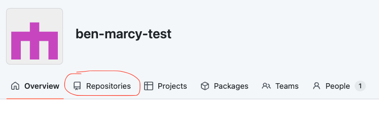
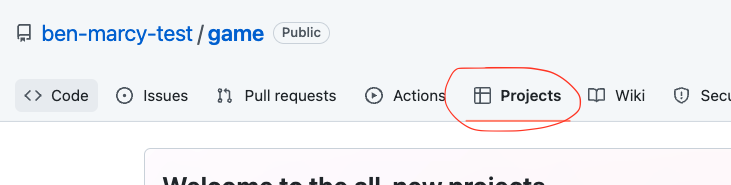
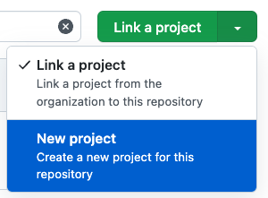
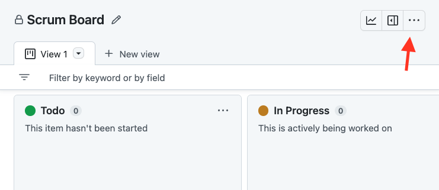

# Creating a Github Projects Scrumboard

**Table of Contents:**
- [Set up Github Organization](#set-up-github-organization)
- [Create an organization repository](#create-an-organization-repository)
- [Create a project board for the repository](#create-a-project-board-for-the-repository)
- [Tips for Using a Scrum Board](#Tips-for-Using-a-Scrum-Board)

You will be using Github Projects to organize and manage your workflow. You can follow the instructions below to get started!

## Set up Github Organization
* Sign into Github
* In the top right corner, find the <kbd>+</kbd> icon and select <kbd>New organization</kbd>
* Select <kbd>Create a free organization</kbd>
* Name the organization with an approved team name
* One team-member will enter their email and will make the organization on their personal account.
* Add all teammates to the organization

## Create an organization repository
* From the organization overview page, click on the <kbd>Repositories</kbd> tab.

* Click on <kbd>Create a new repository</kbd>
* Give your repository a fun name that matches the name of your game!
* Make sure to make the repo **public**
* Add a **README**
* Choose the **MIT License** 

## Create a project board for the repository
* From the repository homepage, click on the <kbd>Projects</kbd> tab.

* Click on the dropdown next to <kbd>Link a project</kbd> and select <kbd>New project</kbd>

* Then, click on <kbd>New project</kbd>
    * Name the project board: “Scrum Board”
    * Create a **Board**, not a Table
* Modify the settings which can be found by clicking on the three dots <kbd>...</kbd> in the top right corner and then selecting **Settings**

  * [Optional] Add a description and a README
  * Change the visibility to **Public**

## Tips for Using a Scrum Board
1. **Work together at the beginning to establish the foundation of your project**
   * Setting up your files, creating your HTML elements, and agreeing upon variable names and data structures together will ensure that as you split up and work on your own features, you are all on the same page.
2. **Organize your JavaScript code into clear sections.**
   * I recommend the following sections (see my [Pong](https://github.com/The-Marcy-Lab-School/Fall-2022-Curriculum-BMC/blob/main/se-unit-5/pong/index.js) example):
      * Variables
      * Initial Setup
      * New Frame Logic
      * Event Handler Logic
      * Helper Functions
   * The bulk of your code should live in the helper functions section and the rest of your code should simply invoke the appropriate helper function in the appropriate order.
   * This approach will allow you to assign individuals to work on separate functions and minimize merge conflicts.
4. **Get the size of the task right. Aim for a single function's worth of work.** Consider these examples for Pong:
   * Too big: _Implement scoring_
      * Why? Implementing scoring is too vague! Scoring involves checking the DOM to see if the ball has left the screen, updating the scoring data, rendering it to the screen, and checking if the score triggers the end of the game. We can be more specific.
   * Too small: _Declare a `score` variable_
      * Why? declaring a single variable may be just one step towards writing a function to handle scoring.
   * Just right: _Keep track of scoring data each time the ball leaves the screen_ 
      * Why? This task is very specific and it focuses on a particular interaction between the DOM and the program's data. We might have a separate task for rendering the data to the screen and another for ending the game at a particular score threshold.
5. **Proactively update the scrum board:**
   * Assign yourself to a task that you want to tackle and immediately move it to _In Progress_. This will prevent your team from doing duplicate work by showing ownership of tasks and will result in more autonomous work.
   * Remember to move tasks to _Done_. Not only will it let your teammates know that a feature is complete, it will also _feel_ really good to make that progress!
   * Consider coming up with a team ritual for completing tasks. Maybe you have some slack message or emoji that you all send and you can breifly have a congratulatory moment! This is not just for team-building, it will also keep your teammates up-to-date on the state of the program.
6. **Prioritize minimum-viable-product features first**. For Pong, the prioritization might look like
   * Render two paddles and a ball to the screen in correct starting positions
   * Control the paddles with keyboard inputs
   * Move the ball on each new frame
   * Detect collisions between the ball and the paddles
   * Bounce the ball off the top and bottom walls
   * Add scoring when the ball goes past the paddles
   * Implement a restart feature
   * Implement bonus features (AI mode, leaderboards, etc...)
